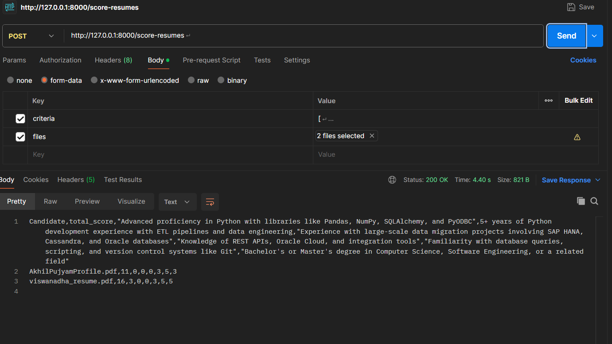
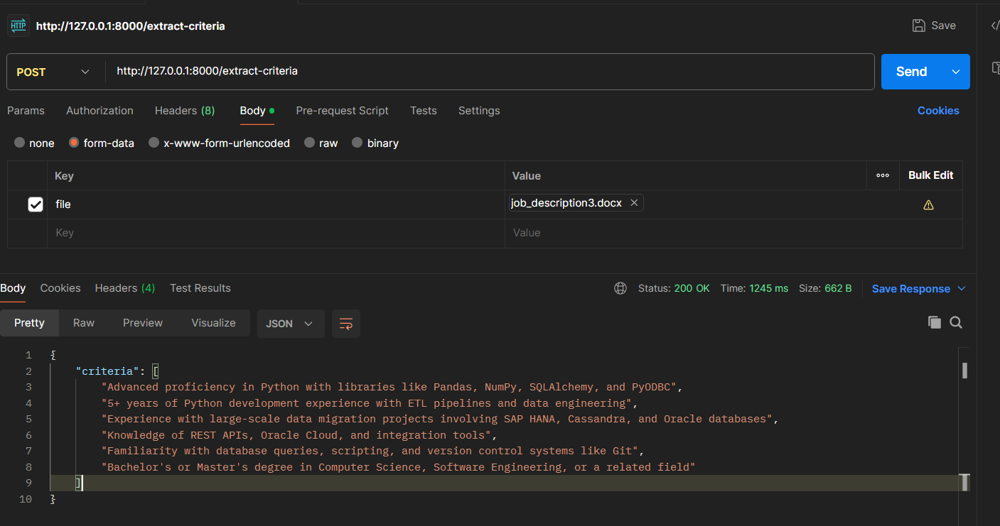

Resume Ranking API
This FastAPI-based web service automates resume ranking based on a job description using Groq's AI model. It extracts key job ranking criteria from a job description and scores resumes accordingly. The results can be downloaded as a CSV file.

Features
✅ Extracts job ranking criteria from a job description (PDF/DOCX)
✅ Scores resumes based on extracted criteria
✅ Outputs results in CSV format
✅ Uses FastAPI for the backend and Groq LLM API for evaluation

TO run the code, in our python IDE, you should have installed required libararies specified in requirements .txt

after that find the main.py file which holds the main logic,

navigate to project code folder, and run below command to start the code running.

: uvicorn main:app --reload

You can find the sample job description and resume sample dpdf s in project folder.
use those for testing its working.

we have 2 API endpoints :

1) /extract-criteria:
* which takes the job_description file as input and returns the eligibility critreia in structures format.

2) /score_resumes:
* which takes 2 parameters: resume_files and job_criteria_list (which is generated from previous endpoint).

returns a output scoring each resume based on job criteria. you can save that as csv file 

Note: please refer to Vedio recording for better understanding.

Postman Screenshots for reference:

